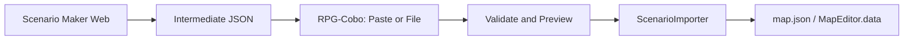

# aiscenario マイルストーン

Issue #2 / PR #3 の PoC から本運用までの工程一覧。

## 現在地（2026-06-25）

| ID | 内容 | 状態 | 主な成果物 |
|---|---|---|---|
| **M0** | PoC 安定化 | **完了** | `ScenarioImporter.sk` Path A/B、`tabeditors` 対応 |
| **M1** | JSON 貼り付け取り込み | **完了** | `ImportDialog.sk`, `importFromText()` |
| **M2** | JSON ファイル選択 | **完了** | `ImportDialog.runFile()`, `FileDialog` |
| **M3** | validate / preview | **完了** | `validateScenario()`, import 前確認ダイアログ |
| **M4** | Scenario Maker 正式導線 | **完了** | Pages URL, README 手順 |
| **M5** | AI 生成パイプライン | **スタブ** | `ScenarioAI.sk`（未実装、境界のみ定義） |

## ユーザー視点の流れ（M4 完了時点）

1. **Scenario Maker**（Web）で中間 JSON を生成
2. RPG-Cobo **編集 → JSON シナリオ取り込み...**
3. 貼り付け or ファイル選択
4. 対象 map / events プレビュー → Import
5. マップ再オープンで確認

## M5（未実装）の設計境界

- AI は **中間 JSON 文字列** だけ生成
- `map.json` / `MapEditor.data` には直接書かない
- 必ず `ScenarioImporter.validateText()` → `ImportDialog.importValidated()` を通す
- 入口: `ScenarioAI.runGenerateAndImport(prompt)`（現状は未実装例外）

## 関連

- 技術正本: [aiscenario-poc.md](./aiscenario-poc.md)
- プラグイン README: [../project/plugin/aiscenario/README.md](../project/plugin/aiscenario/README.md)
- Scenario Maker Pages: https://matrix9neonebuchadnezzar2199-sketch.github.io/aiscenario-maker/
