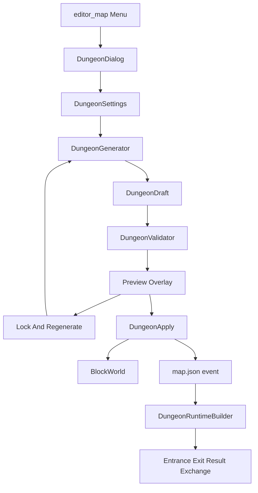

# Random Dungeon Generator — 設計正本

`rpgcobo-tool` 向け **ランダムダンジョン生成プラグイン** の技術設計正本。  
エディタ内の半自動マップ生成と、ゲーム内の入口/出口/リザルト/ポイント交換を一体で扱う。

- **プラグイン ID**: `randomdungeon`
- **配置**: `project/plugin/randomdungeon/`
- **参照実装**: `project/plugin/aiscenario/`（独立プラグイン・二経路保存・検証ゲート）
- **詳細仕様**: `project/plugin/randomdungeon/docs/` 配下

---

## 1. 目的とスコープ

| 領域 | 内容 |
|------|------|
| エディタ | シード付き王道ダンジョン生成、プレビュー、ロック＆部分再生成、確定反映、Undo |
| ランタイム | 入口転送、ダンジョン内探索、出口帰還、戦利品評価、換金、ポイント蓄積、交換所 |
| 非スコープ（v0.1） | 洞窟/迷路モード、複数階層、専用 Result UI、外部マップへの自動入口配置 |

**最重要コンセプト**: 「全部おまかせ」ではなく **編集可能な自動生成**。  
ランダム生成 = マップ制作の下書き生成ツール。

---

## 2. アーキテクチャ



### 2.1 モジュール構成

| ファイル | 責務 |
|----------|------|
| `plugin.sk` | `pluginfo`, `loadPlugin`, メニュー登録 |
| `DungeonModel.sk` | `DungeonDraft`, 部屋/接続/エンティティ型 |
| `DungeonGenerator.sk` | Graph-first 生成、シード RNG |
| `DungeonValidator.sk` | 到達性・重なり・品質スコア |
| `DungeonApply.sk` | BlockWorld / event への確定反映、Undo |
| `DungeonDialog.sk` | 設定 UI、プレビュー、確定/キャンセル |
| `DungeonRuntimeBuilder.sk` | 入口/出口/リザルト/交換イベント生成 |
| `DungeonTheme.sk` | テーマ → ブロック ID マッピング |
| `check/check-randomdungeon.mjs` | オフライン回帰チェック |

### 2.2 プラグイン登録

`project/plugin/plugin.json` に `randomdungeon` を追加（`enable: true`, `lock: false`）。

`loadPlugin` は `aiscenario` と同パターン:

1. `if (!::["SKStudio"]) return false`
2. プロジェクト未セットアップ時は return
3. `module.hookAction("editor_postload", ...)` で依存 `.sk` を `::runsk` 順ロード
4. `::skstudio.registerMenu({ where=["editor_map"], ... })`

---

## 3. 中間データ `DungeonDraft`

タイルマップへ直接書く前に必ず `DungeonDraft` を経由する。

```json
{
  "schemaVersion": 1,
  "seed": "ruin-2026",
  "mode": "classic",
  "themeId": "stone_ruins",
  "bounds": { "x": 0, "y": 0, "z": 0, "w": 80, "h": 64, "d": 80 },
  "settings": { },
  "rooms": [],
  "connections": [],
  "entities": [],
  "locks": [],
  "quality": { "score": 0, "checks": [] },
  "runtimeHooks": {
    "hubMapId": "M001",
    "dungeonMapId": "M050",
    "returnDest": { "mapid": "M001", "evid": null, "pos": [10, 1, 10, 0] }
  }
}
```

| フィールド | 説明 |
|------------|------|
| `rooms[]` | `id`, `type`, `x,y,w,h`, `locked`, `tags` |
| `connections[]` | `from`, `to`, `type` (corridor / locked_door) |
| `entities[]` | `type`, `roomId`, `x,y,z`, `templateId`, `params` |
| `locks[]` | 再生成時に保持する部屋 ID または矩形 |
| `runtimeHooks` | 入口/帰還先マップ・イベント参照 |

サンプル: `project/plugin/randomdungeon/sample/draft-classic.json`

---

## 4. 報酬・ポイントモデル（確定）

詳細: [reward-model.md](../project/plugin/randomdungeon/docs/reward-model.md)

| 概念 | 実装 |
|------|------|
| ラン中戦利品 | **実アイテムは付与しない**。`G101`（run loot score）へ `cmd_compute` で加算 |
| 評価・換金 | 出口リザルトで `G101` → `cmd_moneyop`（N000）＋ `G102`（dungeon points）加算後 `G101=0` |
| 永続ポイント | `G102` type=2 数値 gvar（プロジェクト側で名前定義） |
| 交換解放 | `G110`〜`G129` boolean。store `reqs` で参照 |
| 交換所 | `store` type=0 + `clerk`、価格は gvar 減算を `custom` イベントで実装（v0.2） |

`point.json` はシステム固定のため拡張しない。`store` type=2 の runtime roll は未確認のため、宝箱抽選は `RND99` + `cmd_if` で生成する。

---

## 5. 生成アルゴリズム v0.1

詳細: [generator-mvp.md](../project/plugin/randomdungeon/docs/generator-mvp.md)

1. **Graph**: 入口 → 主経路 → ボス → 出口。分岐・宝箱・罠を枝として追加
2. **Room placement**: 長方形、非重複、端寄り抑制
3. **Corridors**: L字通路、`corridorWidth` マス
4. **Tiles**: 床マスク → 壁自動生成（テーママップ参照）
5. **Entities**: 部屋タイプと入口距離に応じて敵/宝箱配置
6. **Validate**: BFS 到達性、重なり、イベント座標の通行可能チェック

---

## 6. マップ反映（Apply）

詳細: [apply-path.md](../project/plugin/randomdungeon/docs/apply-path.md)

- **プレビュー中**: `editor.bw` / `editor.data` へ書かない
- **確定時**: 単一 `editor.submitOp(redo, undo)` でブロック＋イベントを原子的に反映
- **開いているマップ**: `tabeditors["/.x/map/"+mapid]` 優先（`ScenarioImporter.getOpenMapEditor` 相当）
- **ギズモ**: `canvas.placeEventGizmo` + `tool.updateEventList` + `updateChangeFile`
- **メッシュ**: `canvas.loadInCameraMesh(20)` を `suspend()` ループで分割

---

## 7. ランタイムイベント

詳細: [runtime-events.md](../project/plugin/randomdungeon/docs/runtime-events.md)

| テンプレート | ロール / 方式 |
|--------------|----------------|
| 入口（会話） | `custom` + `cmd_choices` → `cmd_mapmove` |
| 入口（魔法陣） | `portal`、trigger 5（進入） |
| 入口（扉） | `door` + 隣接 `portal` |
| ダンジョン出口 | `custom` → リザルト macro → `cmd_mapmove` 帰還 |
| 宝箱 | `itemchest` または `custom`（G101 加算のみ） |
| 敵 | `enemy` + `encount.gid` |
| ボス | `enemy` + 専用 gid、部屋 type=boss |
| 交換 NPC | `clerk` + `storeid` |
| 解放ゲート | `custom` + `reqs` on `G11x` |

---

## 8. UI

### 8.1 サイドパネル（`DungeonDialog`）

- 生成モード（v0.1: 王道のみ）
- テーマ、サイズ、部屋数、シード、敵密度、宝箱/罠数、ボス部屋 ON/OFF
- 入口/出口: 自動 / 手動座標
- ボタン: プレビュー生成 / 部分再生成 / 確定 / キャンセル

### 8.2 プレビュー

部屋タイプを色分けオーバーレイ（エディタ canvas 上または 2D ミニマップ `SKView`）。  
確定前は `DungeonDraft` のみ更新。

---

## 9. 実装フェーズ

| Phase | 内容 |
|-------|------|
| 0 | 本設計書・仕様・gvar 予約・サンプル JSON（**現在地**） |
| 1 | 王道生成、プレビュー、確定、Undo、入口/出口/ボス |
| 2 | ランタイムループ、リザルト、ポイント、交換所 |
| 3 | ロック再生成、履歴、プリセット、品質スコア UI |
| 4 | 洞窟/迷路/テンプレ部屋/複数階層/専用 Result UI |

---

## 10. 検証

詳細: [verification.md](../project/plugin/randomdungeon/docs/verification.md)

- オフライン: `check/check-randomdungeon.mjs`
- 手動: `check/MANUAL-CHECKLIST.md`
- 必須: 到達性、Undo 一体復元、開きタブ上書き防止、ギズモ同期

---

## 11. gvar 予約（プラグイン用）

プロジェクトの `gvar.json` にユーザーが追加する想定の ID 帯:

| ID | type | 用途 |
|----|------|------|
| `G100` | 1 bool | ダンジョンラン中フラグ |
| `G101` | 2 num | 今回ランの戦利品スコア（持ち出し不可） |
| `G102` | 2 num | 永続ダンジョンポイント |
| `G103` | 2 num | 最終リザルト表示用キャッシュ |
| `G110`–`G129` | 1 bool | 交換アイテム解放フラグ |

---

## 12. 関連ファイル

| パス | 内容 |
|------|------|
| `project/plugin/randomdungeon/docs/reward-model.md` | 報酬モデル確定 |
| `project/plugin/randomdungeon/docs/generator-mvp.md` | v0.1 生成仕様 |
| `project/plugin/randomdungeon/docs/apply-path.md` | 反映・Undo 仕様 |
| `project/plugin/randomdungeon/docs/runtime-events.md` | イベントテンプレート |
| `project/plugin/randomdungeon/docs/verification.md` | テスト計画 |
| `project/plugin/aiscenario/ScenarioImporter.sk` | 保存経路参照 |
| `project/plugin/rpgtools/mapeditor/BlockOperation.sk` | ボクセル Undo |
| `project/data/map.json` M983/M984 | ダンジョンテンプレート |
